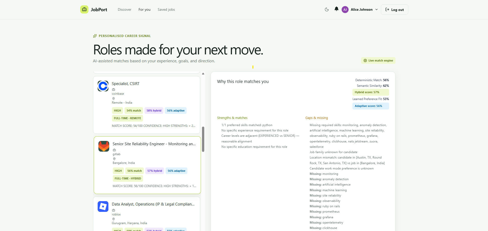
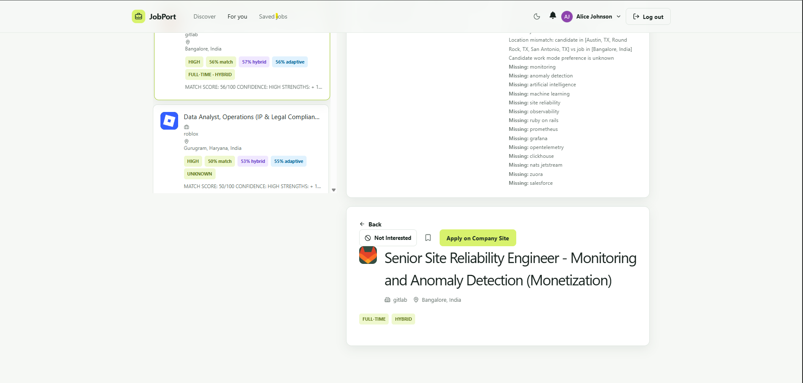
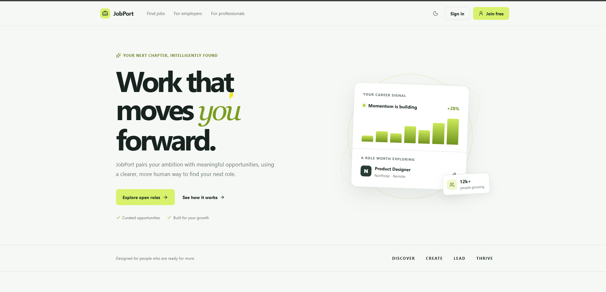
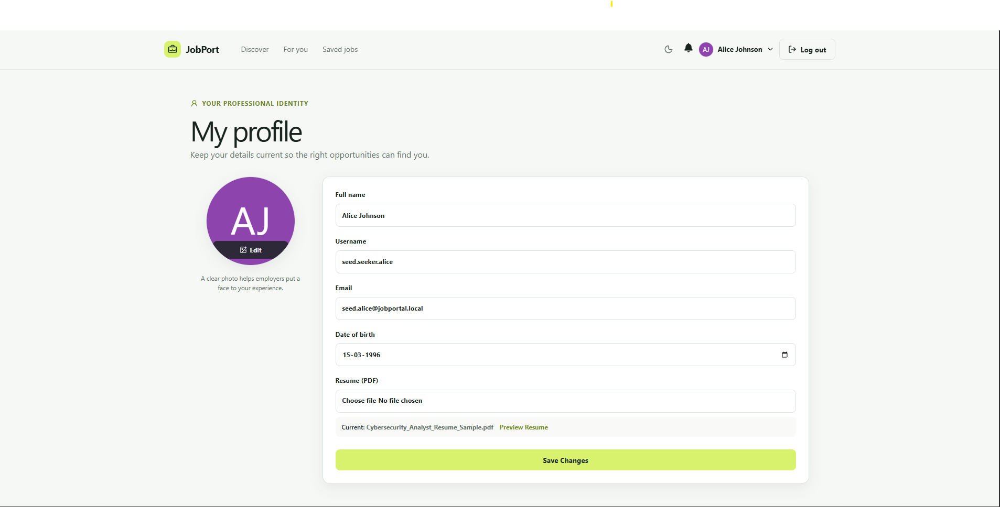
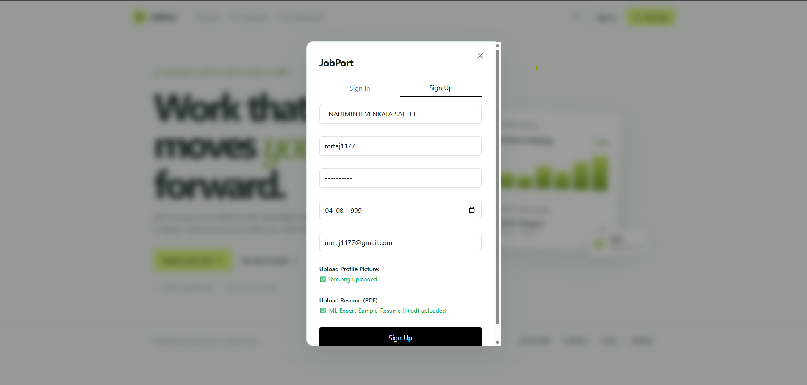
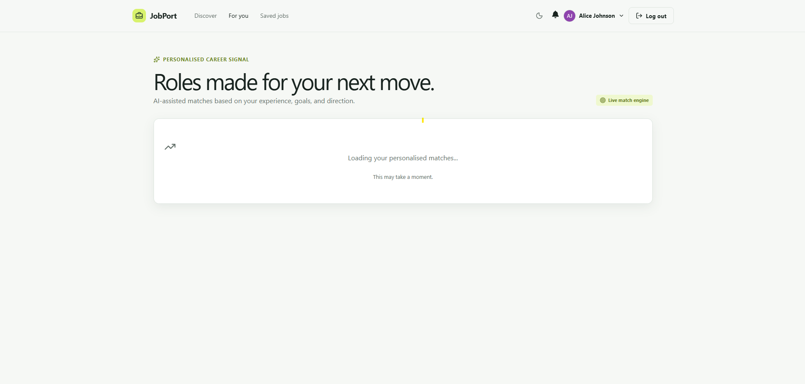

# 🌐 Career Intelligence Personalized Job Platform

[](https://www.oracle.com/java/)
[](https://spring.io/projects/spring-boot)
[](https://reactjs.org/)
[](https://vitejs.dev/)
[](https://www.postgresql.org/)
[](https://ollama.ai/)
[](https://tailwindcss.com/)

> **Next-generation AI-driven career discovery and candidate recommendation platform.**  
> Built with **Spring Boot 3**, **React 18**, **PostgreSQL with pgvector**, and local **Ollama (Llama 3.2 + nomic-embed-text)**.

---

## 📸 Platform Showcase

| Personalized Career Recommendations | Intelligent Job Matching & Explanations |
| :---: | :---: |
|  |  |
| *80/20 Hybrid Scoring, Learned Preference Fit, and Match Breakdown* | *Deep match explanation, required/missing skills, and apply integration* |

| Modern Homepage Experience | Candidate Profile & Resume Intelligence |
| :---: | :---: |
|  |  |
| *Curated opportunities with live career signals* | *PDF resume extraction with automated skills and experience parsing* |

| Sign Up & Resume Parsing | Live Match Engine Loading State |
| :---: | :---: |
|  |  |
| *Frictionless onboarding with resume upload* | *Real-time vector matching and adaptive re-ranking* |

---

## 🚀 What the Project Does

The **Career Intelligence Personalized Job Platform** bridges the gap between traditional job boards and intelligent career placement. Instead of relying solely on keyword search or manual company postings, the platform implements an autonomous, privacy-preserving AI architecture:

1. **Autonomous Multi-ATS Discovery**: Continuously extracts real-time job openings directly from top tech companies across **Greenhouse**, **Lever**, and **Ashby** without manual intervention.
2. **India & Remote Location Intelligence**: Employs an intelligent geographical normalizer that identifies pan-India locations, tier-1/tier-2 tech hubs, city spelling variants (e.g., Bengaluru vs. Bangalore), and flexible remote policies.
3. **Local-First LLM Semantic Enrichment**: Uses **Llama 3.2** running locally via Ollama to extract structured schemas (skills, preferred skills, seniority levels, job families, salary bands, and summaries) with zero external API costs or data leakage.
4. **Vector Embeddings & Semantic Search**: Generates dense 768-dimensional embeddings using `nomic-embed-text` stored in PostgreSQL with `pgvector` for deep semantic similarity calculation.
5. **80/20 Hybrid Recommendation Engine**: Blends deterministic rule-based evaluation (skills overlap, seniority, title match, location fit) with semantic vector cosine similarity using a locked 80/20 formula.
6. **Adaptive Candidate Personalization (Stage 6)**: Learns candidate preferences continuously through implicit and explicit interaction feedback (saves, applies, dismissals) to adapt recommendation ranking in real time.
7. **Resume Intelligence**: Parses uploaded candidate PDF resumes, extracts structured career profiles, and maps competencies to live open roles.

---

## 🏛️ System Architecture

The platform is decoupled into two independent execution cycles to guarantee scalability and prevent network I/O from blocking AI orchestration:

```
                                  ┌─────────────────────────────────────────────────────────┐
                                  │                  SCHEDULER SUBSYSTEM                    │
                                  └───────────────┬─────────────────────────┬───────────────┘
                                                  │                         │
                                    (Every 1 Hour)│                         │(Targeted Delta)
                                                  ▼                         ▼
┌───────────────────────────────────────────────────────┐   ┌───────────────────────────────────────────────────────┐
│              COLLECTION CYCLE (IO-BOUND)              │   │             AGENT INTELLIGENCE CYCLE (AI)             │
├───────────────────────────────────────────────────────┤   ├───────────────────────────────────────────────────────┤
│  1. Source Registry (Greenhouse, Lever, Ashby)        │   │  1. Observation Snapshot Service                      │
│  2. Controlled Concurrency Crawlers (ExecutorService) │   │     - Identify NEW & CHANGED jobs                     │
│  3. India/Remote Location Intelligence Normalizer     │   │     - Exclude UNCHANGED historical records            │
│  4. SHA-256 Content Hashing                           │   │  2. Local Llama 3.2 Semantic Enrichment               │
│  5. Lifecycle Engine: NEW, CHANGED, UNCHANGED, MISSING│   │  3. nomic-embed-text 768d Vector Embeddings           │
│  6. PostgreSQL `raw_job_observation` & `source_job`   │   │  4. Deterministic Candidate Matching (Rule Weights)   │
└───────────────────────────┬───────────────────────────┘   │  5. pgvector Cosine Semantic Similarity Engine        │
                            │                               │  6. Immutable 80/20 Hybrid Scoring Formula            │
                            ▼                               │  7. Adaptive Preference Re-Ranking (Feedback Signals) │
               ┌─────────────────────────┐                  │  8. PostgreSQL Persistence & Recommendation Cache     │
               │   PostgreSQL Database   │◄─────────────────┴───────────────────────────────────────────────────────┘
               │  (pgvector + Relations) │
               └────────────┬────────────┘
                            │
                            ▼
               ┌─────────────────────────┐
               │    Spring Boot REST     │
               │ Authenticated Endpoints │
               └────────────┬────────────┘
                            │
                            ▼
               ┌─────────────────────────┐
               │   React 18 + Vite UI    │
               │ (Tailwind, Lucide Icons)│
               └─────────────────────────┘
```

---

## 🧩 Deep Dive: Core Subsystems

### 1. Multi-ATS Ingestion & Controlled Concurrency
- **Adapters Supported**:
  - `GreenhouseAdapter`: Parses public Greenhouse job boards and extracts structured job descriptions.
  - `LeverAdapter`: Ingests Lever posting feeds and normalizes custom categories.
  - `AshbyAdapter`: Connects to AshbyHQ public API endpoints with rich team and location metadata.
- **Controlled Concurrency**: Multi-threaded execution via a bounded `ThreadPoolTaskExecutor`. Thread limits, timeouts, and bounded retries with exponential backoff prevent external ATS rate limiting (HTTP 429).
- **India & Remote Location Intelligence**: A dedicated rule engine that evaluates:
  - Exact country matches: `India`, `Remote - India`, `Work from anywhere in India`.
  - Major tech hubs & spelling variants: `Bengaluru` / `Bangalore`, `Gurugram` / `Gurgaon`, `Hyderabad`, `Pune`, `Mumbai`, `Noida`, `Chennai`, `Delhi NCR`, `Kolkata`, `Ahmedabad`, `Jaipur`, `Kochi`, etc.
  - Indian states and remote classifications.

### 2. Job Identity & Lifecycle State Machine
Jobs are tracked via canonical company identifiers and SHA-256 hashes:
- **`NEW`**: First time an external job ID is observed. Triggers initial observation and queues for AI enrichment.
- **`UNCHANGED`**: Same external job ID and identical SHA-256 content hash. Zero redundant Llama or embedding calls.
- **`CHANGED`**: Identical job ID but altered job content. Appends a new versioned `RawJobObservation` row, preserving historical versions for auditability.
- **`MISSING`**: Job absent from ATS feed. Monitored across consecutive observation cycles. Automatically transitioned to inactive after 3 consecutive missing cycles.

### 3. Local Llama 3.2 Semantic Enrichment
- Communicates directly with local **Ollama** at `http://localhost:11434`.
- Strict zero-hallucination prompt extracts:
  - `careerLevel`: `ENTRY_LEVEL`, `EXPERIENCED`, `SENIOR`, `LEAD`, `MANAGER`, etc.
  - `jobFamily`: `ENGINEERING`, `DATA_AI`, `PRODUCT`, `DESIGN_UX`, etc.
  - `skills` & `preferredSkills`: Explicit technical qualifications.
  - `experienceYearsMin` / `experienceYearsMax`, `salaryMin` / `salaryMax`, and work modes.

### 4. Vector Embeddings & pgvector Semantic Similarity
- **Embedding Model**: `nomic-embed-text` (768 dimensions).
- **pgvector Integration**: Stores embeddings for both candidate profiles and job enrichments.
- **Cosine Distance**: Computes semantic similarity:
  $$\text{Semantic Score} = \max\left(0, (1 - \text{cosine\_distance}) \times 100\right)$$

### 5. Deterministic & 80/20 Hybrid Recommendation Engine
- **Deterministic Matcher**: Evaluates 5 core dimensions:
  1. Required Skills Match (35%)
  2. Preferred Skills Bonus (10%)
  3. Career Level Alignment (25%)
  4. Work Mode / Remote Preference (15%)
  5. Location Compatibility (15%)
- **Locked 80/20 Hybrid Formula**:
  $$\text{Hybrid Score} = (0.80 \times \text{Deterministic Score}) + (0.20 \times \text{Semantic Score})$$

### 6. Stage 6 Adaptive Candidate Personalization
- Learns from candidate user interactions:
  - **Positive Signals**: Job Applications ($+1.0$), Saved Jobs ($+0.6$).
  - **Negative Signals**: "Not Interested" Dismissals ($-0.8$).
- Dynamically adjusts final ranking to emphasize domains and seniority levels the candidate prefers while penalizing dismissed styles.

---

## 🛠️ Tech Stack

| Layer | Technology | Description |
| :--- | :--- | :--- |
| **Backend** | **Java 17 / Spring Boot 3.5** | Robust enterprise REST service with Spring Security & JPA |
| **Frontend** | **React 18 / Vite 5 / Tailwind CSS** | Fast, responsive modern SPA with Lucide icons |
| **Database** | **PostgreSQL 18.6** | Primary relational database with `pgvector` extension |
| **AI / Local LLM** | **Ollama** (`llama3.2` & `nomic-embed-text`) | Local LLM inference & 768-dim vector embeddings |
| **File Storage** | **Local Storage / Cloudinary** | Dual-mode profile picture and resume PDF handler |
| **PDF Extraction** | **Apache PDFBox** | Fast, secure resume text extraction |

---

## 📡 Major API Endpoints

### 1. Career Intelligence Sources Management
| Method | Endpoint | Access | Description |
| :--- | :--- | :--- | :--- |
| `POST` | `/api/career-intelligence/sources` | Admin | Register new ATS source (Greenhouse, Lever, Ashby) |
| `GET` | `/api/career-intelligence/sources` | Admin | List all registered companies and ATS platforms |
| `PUT` | `/api/career-intelligence/sources/{id}` | Admin | Update company name, board token, or platform |
| `PATCH` | `/api/career-intelligence/sources/{id}/enabled` | Admin | Enable or disable job collection for a source |
| `DELETE` | `/api/career-intelligence/sources/{id}` | Admin | Remove source from collection registry |

### 2. Autonomous Agent & Orchestration
| Method | Endpoint | Access | Description |
| :--- | :--- | :--- | :--- |
| `POST` | `/api/career-intelligence/agent/run` | Admin | Manually trigger full AI agent orchestration cycle |
| `GET` | `/api/career-intelligence/agent/status` | Admin | Retrieve latest observation snapshot & health metrics |

### 3. Recommendations & Adaptive Feedback
| Method | Endpoint | Access | Description |
| :--- | :--- | :--- | :--- |
| `GET` | `/recommendations` | Job Seeker | Fetch personalized, hybrid & adaptively ranked jobs |
| `POST` | `/api/career-intelligence/adaptive/interactions` | Job Seeker | Record positive/negative feedback (APPLIED, SAVED, DISMISSED) |

### 4. Core Platform Endpoints
| Method | Endpoint | Access | Description |
| :--- | :--- | :--- | :--- |
| `POST` | `/auth/login` | Public | Authenticate user and receive JWT token |
| `POST` | `/auth/register` | Public | Register Job Seeker / Employer with optional resume PDF |
| `GET` | `/jobs` | Public | Paginated job discovery feed with search & filters |
| `GET` | `/applications/my` | Job Seeker | Track status of submitted applications |

---

## ⚙️ Getting Started & Local Development

### 1. Prerequisites
- **Java 17+** (JDK)
- **Node.js 18+** & **npm**
- **PostgreSQL 15+** (with `pgvector` enabled)
- **Ollama** installed and running locally

### 2. Setup Ollama Models
Ensure Ollama is running and pull the required models:
```bash
# Pull Llama 3.2 for semantic enrichment
ollama pull llama3.2

# Pull nomic-embed-text for vector embeddings
ollama pull nomic-embed-text
```

### 3. Setup PostgreSQL Database
Connect to PostgreSQL and create the database:
```sql
CREATE DATABASE jobportal;
\c jobportal
CREATE EXTENSION IF NOT EXISTS vector;
```

### 4. Configure Backend Environment
Copy the example properties file:
```bash
cp Backend/JobPortal/src/main/resources/application.properties.example Backend/JobPortal/src/main/resources/application.properties
```
*Optional environment variables (defaults work out of the box for local development):*
- `DB_HOST`: Database host (default: `localhost`)
- `DB_PORT`: Database port (default: `5432`)
- `DB_NAME`: Database name (default: `jobportal`)
- `DB_USERNAME`: Database user (default: `postgres`)
- `DB_PASSWORD`: Database password (default: blank)
- `JWT_SECRET`: 256-bit secret string for token signing

### 5. Run the Backend
```bash
cd Backend/JobPortal
./mvnw spring-boot:run
```
The backend will start at `http://localhost:8080`.

### 6. Run the Frontend
```bash
cd Frontend/JobPortalFront
npm install
npm run dev
```
The frontend will start at `http://localhost:5173`.

---

## 🧪 Testing & Verification

The project includes unit, integration, and lifecycle regression tests:

```bash
# Run all core tests
./mvnw test

# Run the Stage 7.8 Agent Lifecycle Validation Test (H2 in-memory)
./mvnw test -Dtest=AgentLifecycleValidationTest

# Run the Stage 7.8 Real PostgreSQL Runtime Verification
./mvnw test -Dtest=Stage78VerificationTest
```

---

## 📊 Project Evolution & Milestones

- **Stage 1**: Foundation architecture, multi-ATS discovery, schema design, and location intelligence.
- **Stage 2**: Local Llama 3.2 integration, zero-hallucination structured parsing, and prompt engineering.
- **Stage 3**: Deterministic candidate-job matching engine and personalized recommendation feed.
- **Stage 4**: pgvector dense embeddings (`nomic-embed-text`), cosine similarity, and 80/20 hybrid scoring.
- **Stage 5**: Autonomous Career Intelligence Agent orchestration and snapshot-based observation.
- **Stage 6**: Adaptive candidate feedback engine, implicit/explicit signal tracking, and dynamic re-ranking.
- **Stage 7.1 – 7.5**: Source registry management API, India location intelligence expansion, decoupled collection scheduling, Ashby adapter, and concurrent crawler scaling.
- **Stage 7.7 – 7.8**: Canonical company identity alignment, 5-company production pilot, and end-to-end real PostgreSQL AI validation.

---

## 🔒 Security & Privacy

- **Local LLM Execution**: All job and resume semantic analyses are performed locally using Ollama. No candidate data is sent to external third-party AI APIs.
- **Credential Protection**: Database passwords, Cloudinary keys, and JWT secrets are managed via environment variables with safe development defaults.
- **Resume Protection**: Candidate PDF resumes and personal uploads are strictly excluded from git tracking via comprehensive root `.gitignore`.

---

## 📄 License

This project is licensed under the [MIT License](LICENSE).
